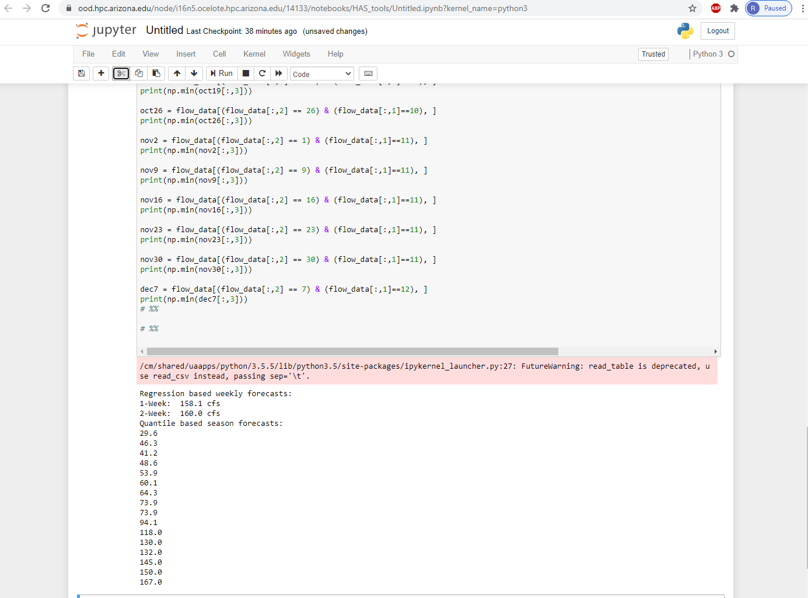

# Marcelain 12/7 Assignment 15

___
### Grade
3/3 - Nice work! I'm glad you got it working even even if you don't have an immediate use for it. 
___

#### Assignment Questions

**1. What resources did you request on Ocelote? How long did you wait in the queue for your job to run and how long did it take to run?**
- I requested the minimum resources as suggested in the homework instructions and Ocelote tutorial.  The job took only 6 seconds to complete.

**2. What was the most confusing part to you about setting up and running your job on Ocelote?**
- Figuring out how to run 'qsub' correctly.  I first attempted to qsub run the tutorial hello_world code, but I kept running into walltime errors.  Must have been a user error, because I recopied the code from the webpage and it ran.  No issues running the python code.

**3. Where else did you run your job? How did the setup compare to your run on Ocelote?**  
- I ran my code on google colab and Ocelote jupyter server.  
- Quite easy and efficient on google colab.  I've used it before and found it to be a great collaboration tool.  Much easier setup than UA HPC, because it doesn't require any setup or instruction.  Plug in code and run, voila!
- The jupyter server on Ocelote was almost the same.  Had issues with numpy quantile, so I had to switch to "np.min" to get similiar numbers for the seasonal forecast.

**4. What questions do you still have after doing this?**
- No questions.  I don't really have any use for the HPC right now, even with my research project.  I did find the tutorials to be sufficient with any questions I had, so I appreciate whoever made them.
