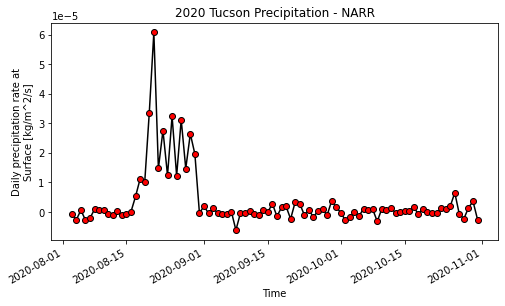
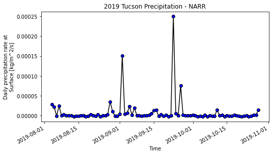

# Marcelain 11/16 Assignment 12

___
### Grade

___

#### Assignment Questions

__1.__ **A Brief Summary.**
The prediction variables I used for building an AR mmodel were the weekly flow data shifted by two weeks.  I adjusted the low results from model by the
difference in flows between this year and the previous 20yr average to produce reasonal numbers.

__2.__ **Description of Dataset Added.**  
- The dataset I added was preciptation from NCEP North American Regional Reanalysis: NARR.
- The spatial resoluation is 349x277 which is approximately 0.3 degrees (32km) resolution.  The temporal resolution is 8-times Daily means for 1979/01/01 to 2020/10/31.
- The dataset was retrieved from NOAA PSL website at https://psl.noaa.gov/data/gridded/data.narr.monolevel.html.
- The approach I used to extract the data was similar to the starter code.  The variable was the same, but the different dimensions meant that I first had to locate the
correct grid for Tucson, AZ.  I then created timeseries plots for 2020 and 2019.  I adjust the dates to only cover the past four months to show meaningful year-to-year changes.

__3.__ **Time Series Plots.**  

