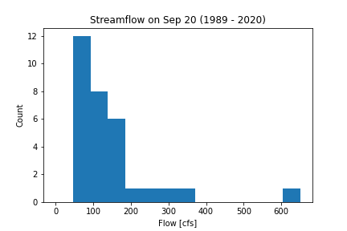
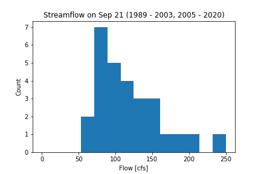

# Marcelain 9/21 Assignment 4

#### Assignment Questions

__1.__ I used quantitative analysis to plot the histogram (Figure 1) of September 21, and used that value as the weekly average for the forecast. However, after looking at the data, I choose to remove the 2004 data since it was anomalously much higher than any other year. Another histogram (Figure 2) was plotted without the year 2004, which changed the figure and quantiles. This year's flow data represents the 10% quantile values, which compelled me to change all future forecasts to represent a much lower than average flow year.

__2.__ The variable flow_data is an array composed of 'year', 'month', 'day' and 'flow' values. The values for the 'year', 'month', and 'day' are integer objects, and the values for 'flow' are float objects. The dimensions of the array are 11585 x 4 with a total size of 46312.

__3.__ The daily flow values were greater than this week's prediction 47.4% of the days recorded (9 out of 19) of this year (2020).

__4.__ The daily flow values were greater than this week's prediction 100% (330/330) of the time before year 2000 and 94.1% (272/289) of the time after year 2010.

__5.__ The daily flow values in early September are generally greater than in late September, implying that streamflow decreases with time during that month. 