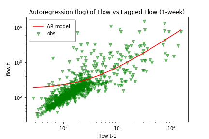

# Marcelain 10/5 Assignment 6

___
### Grade
3/3 - Nice work, great graphs!

___

#### Assignment Questions

__1.__ **Summary of AR Model.**
The prediction variables I used was the weekly flow data shifted (lagged) one week.  
I adjusted the training period for the autoregressive model to cover weeks 100 through 1100.  This would expand the
training period over the default values and also not include late 1980s which showed much less variability than the
rest of the dataset.

**This produced the following values:**
- **r-squared:**   0.31
- **intercept:** 173.85
- **slope:**       0.56

**Using two time lag method produced a marginally better coefficient of determination (r-squared, with higher generally being better):**
- **r-squared:**   0.32
- **intercept:** 151.59
- **slope:**       0.49

__2.__ **Analysis of Model Performance.**  
This model produced results nearly identical to the default assignment values.  No discernable visual different in results as well.  
The results perform well when simulating flow values that are over 110 cfs.  The model fails to predict values lower than that, while
still maintaining the natural intervals (periodicity) which reoccur each year, more or less.  I'll give the model an average score,
because it's both good and bad for the reasons I stated.  If I were to guess, the simulation issue may be caused by the drastically
different extremes between the high and low peaks in the periodicity.  Perhaps a training period that included more extreme lows than
highs (not equal amounts) would lower the average value line to match the observed dataset.

__3.__ **Forecast Summary.**  
I made my forecast again using 2019 data estimates for time periods matching this year's prediction calendar. I used an updated flow dataset
aggregated the data to weekly flows for 2019.  I choose not use the AR model due to it's failure to predict flow below 100, which we are
currently experiencing.  The two week lagged method of 2019 values showed interestingly close results to the 2020 observed weekly values.  I
choose to use this method to for forecasting this week's flow values after judging that it would have accurately produced top 3 (or close)
results for at least two of the last four weeks.
