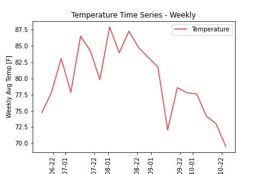
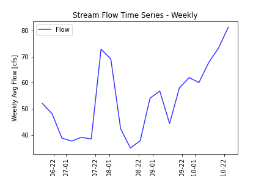

# Marcelain 10/26 Assignment 9

___
### Grade
3/3 - Nice work but I would have like to see you expand a bit more on the example script to choose a different location or a different variable. 

___

#### Assignment Questions

__1.__ **A Brief Summary.**
The prediction variables I used for building an AR mmodel were the weekly flow data shifted by one week.  I chose a training period for
the model which represented more lower values than higher, but the results were still poor (too high).  To make up for the poor results, I
adjusted the values in a function by the difference in flows between this year and the previous 20yr average.

__2.__ **Dataset Added.**  
- The dataset I added was temperature data from the the MesoWest database.  I chose this dataset, becuase I was curious how the relationship
between streamflow and air temperature would be represented at this datasite.
- The location was determined using the mapping tool, where I selected the datasite nearest to the stream flow gauge site.
- The dataset was retrieved from The University of Utah webpage using API: http://api.mesowest.net/v2/stations/timeseries
- The approach I used to access the data was the same as the starter code.  The data was retrived using API formatting and the database
URL. The data was then organized into a dictionary using the JSON python module.  From there, it was converted into a Pandas dataframe.

__3.__ **Time Series Plots.**  

